```mermaid
flowchart TB
    subgraph LEGEND["Leyenda"]
        L1[("Base de datos")]
        L2[/"Artefacto markdown"/]
        L3{"Decisión"}
        L4["Proceso"]
        L5(["Actor externo"])
    end

    subgraph PRE["Paso -1: Análisis de Legacy"]
        direction TB
        P0["Recopilar documentación<br/>(PDFs, Word, código, URLs)"]
        P0 --> P1
        P1["Sub-paso 1:<br/>Clasificar fuentes"]
        P1 --> P1_OUT[/"inventario-fuentes.md"/]
        P1_OUT --> P2
        P2["Sub-paso 2:<br/>Analizar y clasificar"]
        P2 --> P2_OUT[/"mapa-proyecto.md<br/>✅⚠️❓🔲"/]
        P2_OUT --> P3A
        P2_OUT --> P3B
        P3A["Sub-paso 3:<br/>Generar cuestionarios"]
        P3A --> P3A_OUT[/"cuestionarios.md<br/>(negocio + técnico)"/]
        P3B["Sub-paso 3b:<br/>Filtrar para Paso 0"]
        P3B --> P3B_OUT[/"guia-paso-0.md<br/>(priorizado)"/]
        P3A_OUT --> PM_P1["PM entrevista al cliente"]
        PM_P1 --> P4
        P3B_OUT --> P4
        P4["Sub-paso 4:<br/>Incorporar feedback"]
        P4 --> P4_OUT[/"mapa-proyecto-v2.md"/]
        P4_OUT --> P5
        P5["Sub-paso 5:<br/>Documentación consolidada"]
        P5 --> P5_OUT[/"documentacion-proyecto.md"/]
    end

    subgraph P0["Paso 0: Captura de Requisitos"]
        direction TB
        ENTRY{"¿Hay legacy?"}
        ENTRY -- Sí --> QA1["Resolver contradicciones<br/>(guia-paso-0.md)"]
        ENTRY -- No --> QC["Capturar requisitos nuevos<br/>(guia-estandar-paso-0.md)"]
        QA1 --> QC
        QC --> P0_1
        P0_1["Sub-paso 0.1:<br/>Analizar input del cliente"]
        P0_1 --> P0_2
        P0_2["Sub-paso 0.2:<br/>Clasificar RF vs RNF"]
        P0_2 --> P0_2A[/"requisitos-funcionales.md"/]
        P0_2 --> P0_2B[/"requisitos-nofuncionales.md"/]
        P0_2A --> P0_3
        P0_3["Sub-paso 0.3:<br/>Descubrir no funcionales<br/>implícitos"]
        P0_3 --> P0_2B
        P0_2B --> P0_4
        P0_4["Sub-paso 0.4:<br/>Identificar zonas de<br/>incertidumbre"]
        P0_4 --> P0_4_OUT[/"zonas-incertidumbre.md"/]
        P0_4_OUT --> P0_5
        P0_5["Sub-paso 0.5:<br/>Validar con cliente"]
        P0_5 --> PM_0["PM revisa con cliente"]
        PM_0 --> P0_1
    end

    subgraph P1["Paso 1: Framework GEE"]
        direction TB
        GEE_START["Check Init (16 pts)"]
        GEE_START --> GEE_PROFILE["Definir perfil proyecto<br/>(META: bajo/medio/alto/crítico)"]
        GEE_PROFILE --> GEE_RISK[/"registro-riesgos.md<br/>(R-XXX)"/]
        GEE_PROFILE --> GEE_DEP[/"registro-dependencias.md<br/>(DP-XXX)"/]
        GEE_PROFILE --> GEE_ACT[/"registro-acciones.md<br/>(A-XXX)"/]
        GEE_LOOP{"Bucle diario"}
        GEE_LOOP --> CL[/"changelog.md<br/>(SC-XXX)"/]
        GEE_LOOP --> IM[/"registro-impedimentos.md<br/>(IM-XXX)"/]
        GEE_LOOP --> DL[/"dailylog/YYYY-MM-DD.md"/]
        CL --> GEE_RISK
        CL --> GEE_DEP
        CL --> GEE_ACT
    end

    subgraph P2["Paso 2: Roadmap + Backlog"]
        direction TB
        R1["Agrupar requisitos en épicas"]
        R1 --> R2["Construir roadmap temporal"]
        R2 --> R3["Descomponer en HU"]
    end

    subgraph P3["Paso 3: Gestión de Sprints"]
        direction TB
        S1["Planning: DoR + tareas"]
        S1 --> S2["Ejecución + daily"]
        S2 --> S3["Review"]
        S2 --> S4["Retro → lecciones"]
    end

    subgraph GRAPH["Grafo + Vectorial (transversal)"]
        GDB[("Grafo Neo4j<br/>Entidades y relaciones")]
        VDB[("Vectorial Cloudflare iSearch<br/>Documentos indexados")]
        GDB <--> VDB
    end

    subgraph OUTPUT["Adaptadores de salida"]
        OA1["Documento markdown"]
        OA2["Confluence"]
        OA3["PDF"]
        OA4["Prompt para otra IA"]
        OA5["Jira"]
    end

    %% Conexiones entre pasos
    P1 --> P0
    P0 --> P1
    P1 --> P2
    P2 --> P3
    P3 -.->|"Retroalimentación"| P1

    %% Conexión al grafo/vectorial
    P1 --> GRAPH
    P0 --> GRAPH
    P1 --> GRAPH
    P2 --> GRAPH
    P3 --> GRAPH
    GRAPH -.->|"Consultas"| P0
    GRAPH -.->|"Consultas"| P1

    %% Adaptadores
    P0 --> OUTPUT
    P1 --> OUTPUT
    P2 --> OUTPUT
    P3 --> OUTPUT

    %% Actores externos
    PM["👤 PM (Josemi)"] --> P1
    PM --> P0
    CLIENT["👤 Cliente"] -.->|"Entrevista"| PM

    %% Estilo
    classDef process fill:#e1f5fe,stroke:#01579b,stroke-width:2px
    classDef artifact fill:#fff3e0,stroke:#e65100,stroke-width:2px
    classDef database fill:#e8f5e9,stroke:#1b5e20,stroke-width:2px
    classDef external fill:#fce4ec,stroke:#b71c1c,stroke-width:2px
    classDef decision fill:#f3e5f5,stroke:#4a148c,stroke-width:2px

    class P1,P2,P3A,P3B,P4,P5,P0_1,P0_2,P0_3,P0_4,P0_5,GEE_START,GEE_PROFILE,GEE_LOOP,R1,R2,R3,S1,S2,S3,S4,QA1,QC process
    class P1_OUT,P2_OUT,P3A_OUT,P3B_OUT,P4_OUT,P5_OUT,P0_2A,P0_2B,P0_4_OUT,GEE_RISK,GEE_DEP,GEE_ACT,CL,IM,DL artifact
    class GDB,VDB database
    class PM,CLIENT external
    class ENTRY,ENTRY2 decision
```

## Flujo completo del pipeline

| Paso | Estado | Artefactos clave |
|---|---|---|
| **Paso -1**: Análisis de Legacy | ✅ Diseñado + implementado + **probado con caso E-T** | inventario-fuentes.md, mapa-proyecto.md, cuestionarios.md, guia-paso-0.md, documentacion-proyecto.md |
| **Paso 0**: Captura de Requisitos | ✅ Diseñado + guía combinada **lista para usar** | guia-combinada-entrevista.md, requisitos-funcionales.md, requisitos-nofuncionales.md, zonas-incertidumbre.md |
| **Paso 1**: Framework GEE | ✅ Diseñado + **pendiente de implementar** | registro-riesgos.md, registro-dependencias.md, registro-acciones.md, changelog.md, check-init.md, info-riesgos.md |
| **Paso 2**: Roadmap + Backlog | ✅ Diseñado (pendiente implementar) | épicas.md, roadmap.md, backlog.md |
| **Paso 3**: Gestión de Sprints | ✅ Diseñado (pendiente implementar) | sprint-plan.md, sprint-review.md, lecciones.md |
| **Grafo + Vectorial** | ✅ Diseñado (pendiente implementar) | Esquema de entidades/relaciones definido |
| **Flujo Transversal** | ✅ Diseñado | Conexiones entre pasos documentadas |

### Lo implementado hasta ahora (probado con caso E-T)

```
Documento E-T original
        │
        ▼
  ┌─────────────────────┐
  │  Paso -1 (completo) │──▶ inventario-fuentes.md
  │                     │──▶ mapa-proyecto.md (32 aspectos: ✅12 ⚠️5 ❓5 🔲10)
  │                     │──▶ cuestionarios.md (negocio + técnico)
  │                     │──▶ guia-paso-0.md (priorizado para cliente)
  └─────────┬───────────┘
            │
            ▼
  ┌─────────────────────┐
  │  Paso 0 (preparado) │──▶ guia-combinada-entrevista.md (7 temas + 5 bloques)
  │                     │     [PENDIENTE: entrevista al cliente]
  └─────────────────────┘
```

### Cómo usar este diagrama

El diagrama Mermaid se renderiza automáticamente en GitHub. Si usas otra herramienta que no lo soporte, puedes copiar el código en [mermaid.live](https://mermaid.live) para visualizarlo.
